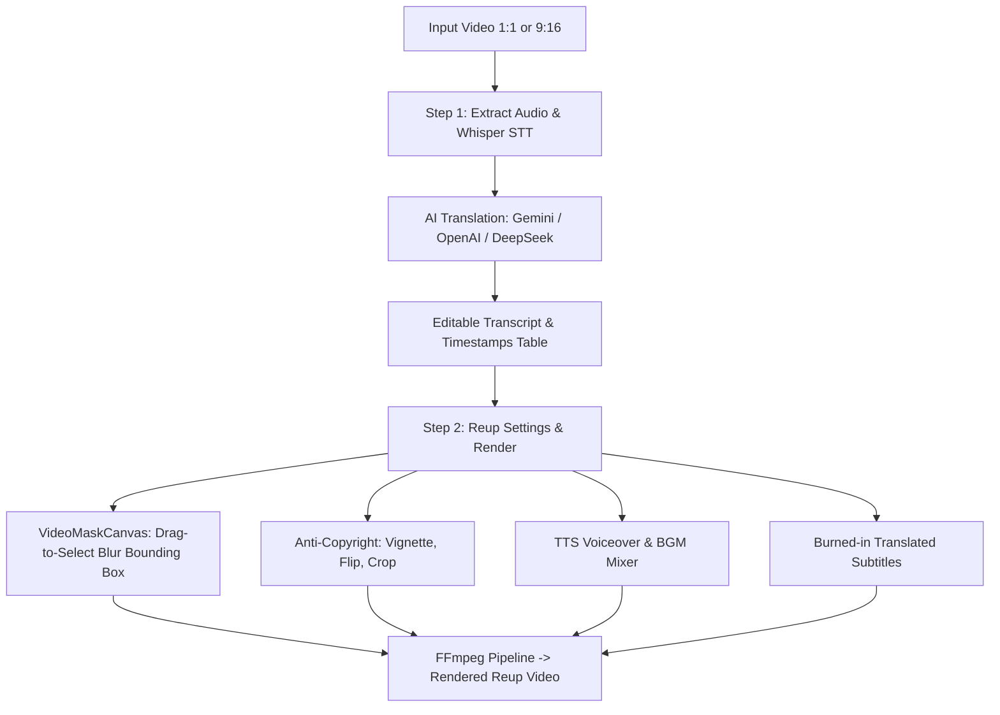

# Design Specification: Automated Reup Video & Dubbing Module

## 1. Goal & Context
The Reup Video module enables users to take an existing square (1:1) or vertical (9:16) video, automatically extract speech, translate the transcript into a target language using AI (Gemini, OpenAI, or DeepSeek with custom Endpoint URL support), review and edit translated lines, apply visual anti-copyright modifications (vignette, blur mask over original burned-in subtitles, mirror, subtle crop), generate dubbed voiceover using TTS, mix background music, and export a polished re-published video.

---

## 2. Architecture & Components

---

## 3. UI Component Details (`src/components/ReupScreen.tsx`)

### 3.1. Sidebar Navigation
- Add new sidebar item **"Reup Video"** (`/reup`).

### 3.2. Top Input & Configuration Panel
- **Source Video Selection**: Accepts `.mp4`, `.mov`, `.mkv` (1:1 square or 9:16 vertical format).
- **Source & Target Languages**: Dropdown choices (Vietnamese, English, Chinese, Japanese, Korean, etc.).
- **Translation Provider**: Select `Gemini API`, `OpenAI API`, or `DeepSeek Flash`.
- **DeepSeek Custom Configuration**:
  - `API Key` input box.
  - `Endpoint URL` input box (defaults to `https://api.deepseek.com/v1`).

### 3.3. Step 1: Speech Recognition & Editable Translation Table
- Button: `[ 1. Trích xuất & Dịch thuật AI ]`
- Data Table:
  - `Time`: Segment start and end times.
  - `Original`: Whisper STT transcript from source audio.
  - `Translated`: Editable textarea for AI translation output.

### 3.4. Step 2: Visual Mask, Anti-Copyright & Render
- **Interactive Original Subtitle Blur Mask Canvas (`VideoMaskCanvas.tsx`)**:
  - HTML5 Canvas overlay on top of HTML5 `<video>`.
  - Enables drawing, dragging, and resizing a bounding box rectangle `(x, y, w, h)` specifying the exact original subtitle area to blur.
- **Anti-Copyright Visual Filters**:
  - Vignette / Dark border intensity slider (`vignette=PI/4`).
  - Horizontal flip checkbox (`hflip`).
  - Subtle zoom / crop checkbox (`crop=iw*0.96:ih*0.96,scale=iw:ih`).
- **Voiceover & Audio Mixer**:
  - Target language TTS Voice selection (Model, Voice, Speed, Prompt).
  - Background Music file picker (`.mp3`/`.wav`) + Voiceover vs BGM volume balance sliders.
- **Translated Subtitles Overlay**:
  - Show/hide subtitles toggle.
  - Subtitle vertical position (Top, Center, Bottom).

---

## 4. Backend Processing Modules

### 4.1. Translation Provider Engine (`electron/translators/translatorFactory.js`)
- `translateSegments({ segments, sourceLang, targetLang, provider, apiKey, endpointUrl })`:
  - **Gemini**: Uses Gemini API with structured prompts.
  - **OpenAI**: Calls `https://api.openai.com/v1/chat/completions`.
  - **DeepSeek**: Calls `${endpointUrl}/chat/completions` with DeepSeek authorization headers and payload format.

### 4.2. FFmpeg Reup Renderer (`electron/reupRenderer.js`)
- Constructs filtergraph:
  - **Subtitle Blur Mask**: `crop=w:h:x:y,boxblur=luma_radius=20:luma_power=2,overlay=x:y`
  - **Visual Filters**: `vignette`, `hflip`, `crop/scale`.
  - **Audio Mixer**: `amix=inputs=2:duration=first:weights="1.0 <BGM_VOLUME>"`.
  - **Subtitle Burner**: `subtitles` filter with position alignment.

---

## 5. Verification Plan

### Automated Tests
1. **Translation Engine Test (`tests/translatorFactory.test.js`)**:
   - Verify payload construction and custom `endpointUrl` formatting for DeepSeek.
2. **Blur Mask Calculation Test (`tests/reupRenderer.test.js`)**:
   - Verify filtergraph generation for bounding box `(x, y, w, h)` coordinates.

### Manual Verification
1. Load a 9:16 vertical video.
2. Run Step 1 (Extract & Translate) with Gemini/DeepSeek. Edit a translated line.
3. Drag bounding box on video canvas over original subtitles.
4. Select TTS voice, enable vignette & flip, and click Render.
5. Verify output video has blurred original subtitles, new TTS voiceover, and optional translated subtitles.
