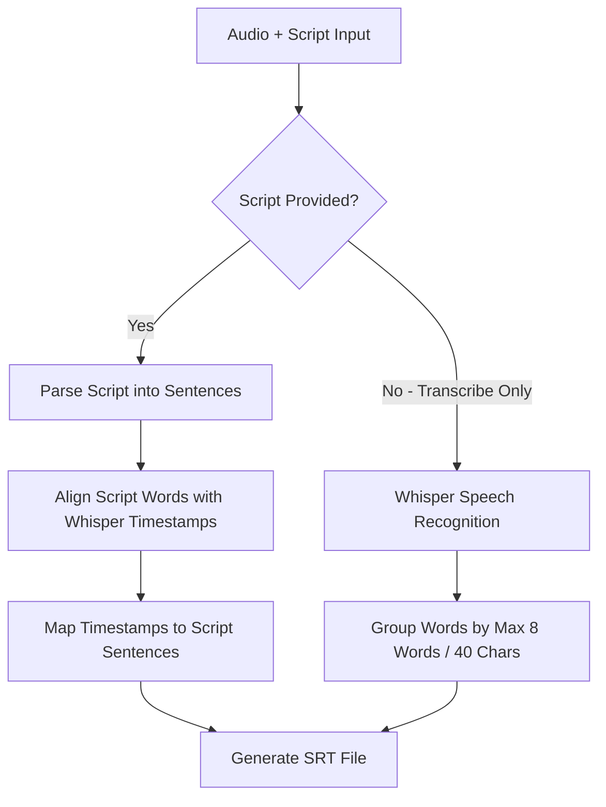

# Design Specification: Script-First Sentence-Level Subtitle Alignment

## 1. Goal & Context
Currently, when generating sentence-level subtitles (`srtLevel === 'sentence'`) with a user-provided script (`scriptText`), the system flattens the script into words and uses fixed threshold heuristic rules (max 8 words or 40 characters) to split subtitle cues. This leads to broken subtitle sentences and incorrect timestamps (e.g., timestamps covering only the last word of a sentence).

The goal of this update is to ensure that when a script is provided, each output SRT subtitle cue corresponds exactly 1-to-1 with a complete sentence/line from the user's script, with `start` timestamp matching the start of the first word and `end` timestamp matching the end of the last word in that sentence.

---

## 2. Architecture & Processing Flow

### Key Components

1. **Script Sentence Parser (`parseScriptSentences`)**:
   - Parses `scriptText` by splitting on sentence-ending punctuation (`.`, `!`, `?`) and newline breaks (`\n`, `\r\n`).
   - Retains exact sentence strings (including original capitalization and punctuation).
   - Tracks which words belong to which sentence.

2. **Word Alignment Engine (`alignScriptAndWhisper`)**:
   - Uses the existing Needleman-Wunsch algorithm (`whisperAligner.js`) to map script tokens to Whisper audio timestamps.
   - Interpolates missing timestamps for unaligned words cleanly so every word has valid `start` and `end` values.

3. **Sentence Timestamp Mapper (`groupWordsByScriptSentences`)**:
   - Maps aligned word timestamps back to the parsed script sentences.
   - For each sentence:
     - `start` = `firstWord.start`
     - `end` = `lastWord.end`
     - `text` = `exactScriptSentenceText`

4. **Pure Transcribe Mode Fallback**:
   - When `transcribeOnly === true` (no script input), the system continues to use `groupWordsIntoSentences(whisperWords, maxWords=8, maxCharLength=40)` to ensure readable subtitle length for pure speech-to-text.

---

## 3. Detailed Changes by Module

### `electron/main.js`
- Introduce `parseScriptSentences(scriptText)` helper function to slice script into sentence blocks while preserving word associations.
- Update `align-audio-and-script` and `concat-and-align` IPC handlers:
  - If `srtLevel === 'sentence'` and `scriptText` is provided:
    - Invoke `groupWordsByScriptSentences(alignment.words, scriptSentences)`.
  - Else if `srtLevel === 'sentence'` and `transcribeOnly === true`:
    - Invoke `groupWordsIntoSentences(whisperResult.words)`.

---

## 4. Verification Plan

### Automated / Manual Tests
1. **Script with Line Breaks**: Verify a multi-line script generates exactly 1 SRT cue per line with `start` equal to first word time and `end` equal to last word time.
2. **Script with Punctuation**: Verify sentences ending in `.`, `!`, `?` produce separate SRT cues.
3. **Pure Transcribe Mode**: Verify `transcribeOnly` mode without script still chunks subtitle cues by 8 words / 40 chars.
4. **Build Verification**: Run `npm run build` and `npm test` to confirm no regression.
