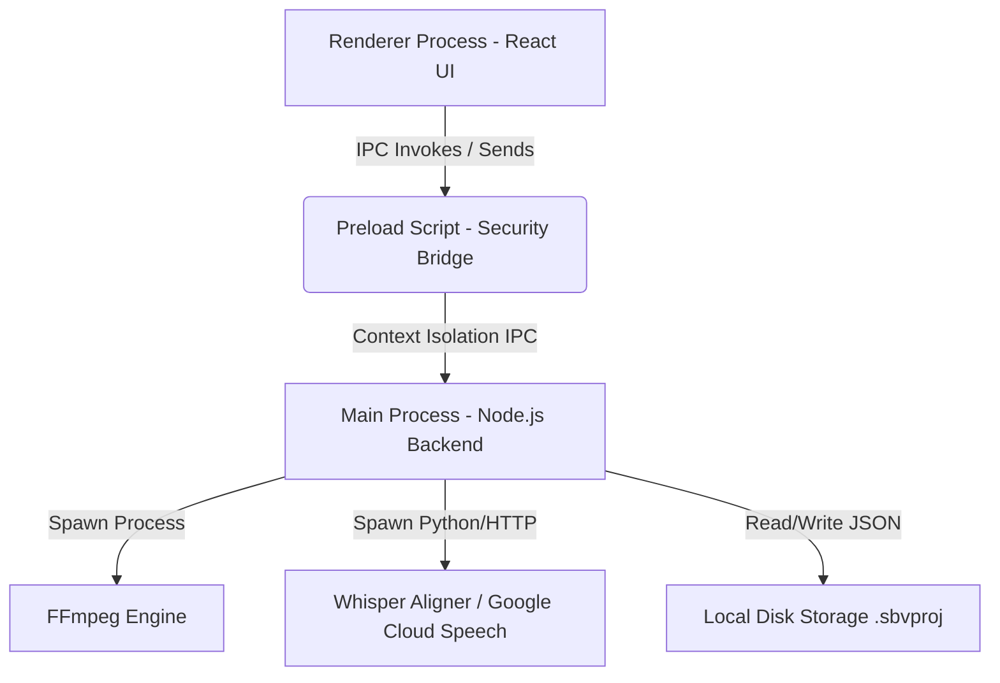

# KIẾN TRÚC HỆ THỐNG (SYSTEM ARCHITECTURE DOCUMENT)
## Dự án: Storyboard-to-Video Tool (Phiên bản v1.0 → v1.8)

Tài liệu này đặc tả chi tiết kiến trúc kỹ thuật, mô hình luồng dữ liệu, liên lạc tiến trình (IPC) và các giải pháp tích hợp công nghệ đa phương tiện đa nền tảng tính đến phiên bản v1.8 hiện tại.

---

## 1. TỔNG QUAN KIẾN TRÚC (HIGH-LEVEL ARCHITECTURE)
Ứng dụng được xây dựng trên nền tảng **Electron Framework** kết hợp với **React (Vite + TypeScript)** ở giao diện người dùng. Electron chia ứng dụng thành hai lớp tiến trình độc lập nhằm đảm bảo bảo mật và hiệu năng xử lý:



### 1.1. Renderer Process (Frontend UI)
*   **Công nghệ**: React, Tailwind CSS, Lucide icons, Vite.
*   **Trách nhiệm**: Đảm nhận vẽ giao diện, hiển thị phim hoạt cảnh (timeline preview), quản lý tương tác người dùng, kiểm tra định dạng nhập liệu (SRT) và thu thập cấu hình xuất video.
*   **Quản lý trạng thái (State Management)**: Sử dụng React Context `ProjectContext` làm nguồn dữ liệu tập trung quản lý toàn bộ tệp, cấu hình âm thanh, hiệu ứng, và trạng thái tiến trình kết xuất video.

### 1.2. Preload Script (`preload.cjs`)
*   Đóng vai trò làm cầu nối bảo mật (Context Bridge). Cô lập hoàn toàn mã nguồn phía trình duyệt khỏi quyền truy cập Node.js trực tiếp.
*   Chỉ phơi bày các API cụ thể (ví dụ: `window.electronAPI.renderVideo`, `window.electronAPI.validateSrt`) sang Renderer Process.

### 1.3. Main Process (Backend Node.js)
*   **Công nghệ**: Node.js, Electron Main.
*   **Trách nhiệm**: Xử lý logic nặng, giao tiếp trực tiếp với hệ điều hành (File System), tích hợp dịch vụ TTS/Whisper qua HTTP/Python, quản lý lưu trữ metadata dự án, và quản lý vòng đời tiến trình FFmpeg sidecar.

---

## 2. BẢN ĐỒ GIAO TIẾP IPC (IPC BRIDGE COMMUNICATION MAP)
Tiến trình Renderer giao tiếp với Main Process thông qua các API IPC chính được đăng ký trong `preload.cjs` và `main.js`:

| IPC Channel | Lớp xử lý ở Main Process | Vai trò chức năng |
|---|---|---|
| `select-directory` | `main.js` | Mở hộp thoại chọn thư mục chứa tệp storyboard. |
| `select-relink-file` | `main.js` | Mở hộp thoại chỉ định lại đường dẫn tệp thất lạc. |
| `save-project` | `main.js` | Ghi đè cấu hình dự án xuống tệp `.sbvproj` dạng JSON. |
| `load-project` | `main.js` | Đọc tệp `.sbvproj` nạp dữ liệu lên UI. |
| `render-video` | `main.js` | Khởi chạy dựng video gốc (ngang) và bản dọc nếu bật. |
| `cancel-render` | `main.js` | Hủy ngang tiến trình FFmpeg đang chạy. |
| `synthesize-speech` | `main.js` | Gửi yêu cầu sinh giọng đọc tới Google/OpenAI TTS. |
| `align-audio-and-script` | `main.js` | Thực thi căn lề Whisper đồng bộ thời gian từ/câu. |
| `validate-srt` | `main.js` | Đọc và kiểm tra cấu trúc cú pháp tệp phụ đề SRT. |
| `get-video-duration` | `verticalConverter.js` | Đo thời lượng (giây) của video nguồn qua ffprobe. |
| `convert-to-vertical` | `verticalConverter.js` / `verticalBatchConverter.js` | Chuyển đổi dọc 9:16 (đơn lẻ hoặc chạy phân đoạn tuần tự). |

---

## 3. ENGINE XỬ LÝ ĐA PHƯƠNG TIỆN (FFMPEG ENGINE SERVICES)
Ứng dụng gọi trực tiếp binary FFmpeg thông qua tiến trình con `spawn` của Node.js, cho phép ghi nhận và phân tích luồng thông tin tiến độ chạy (standard error output) trực tiếp.

### 3.1. Thuật toán render dự án ngang (16:9)
*   **Chuẩn hóa**: Toàn bộ ảnh storyboard đầu vào được chuyển đổi về kích thước chung theo Preset (ví dụ 1920x1080) thông qua filter `scale` và `pad` (nền đen).
*   **Chuyển cảnh (Transitions)**: Sử dụng bộ lọc `xfade` của FFmpeg. Tính toán tham số `offset` (thời điểm chuyển cảnh) cho từng ảnh theo công thức:
    $$\text{offset}_{i} = \sum_{k=0}^{i} \text{duration}_k - \text{duration}_{\text{transition}}$$
*   **Trộn âm thanh (Audio Mixing)**: Sử dụng bộ lọc `amix` để trộn tệp âm thanh giọng đọc (Voice Narration) và nhạc nền/SFX theo cấu hình âm lượng tùy biến (volume).

### 3.2. Thuật toán Convert dọc (9:16)
Lõi lọc trong [verticalConverter.js](file:///c:/Users/vangk/Documents/CodeProject/VideoTool/electron/verticalConverter.js) sử dụng filter graph phức tạp gồm 3 lớp xếp chồng:

```
                  ┌──────────────────────────────────────────────┐
                  │                 FFmpeg Input                 │
                  └──────────────────────┬───────────────────────┘
                                         │
                    ┌────────────────────┴────────────────────┐
                    │                                         │
     [Scale & Blur Layer (Background)]            [Fit Width Layer (Foreground)]
     - scale full cover                           - scale fit width
     - boxblur=20:5                               - overlay central (x, y)
     - drawbox=black@0.3 (dark overlay)                       │
                    │                                         │
                    └────────────────────┬────────────────────┘
                                         │
                                         ▼
                                   [Base Canvas]
                                         │
                                         ▼
                             [Drawtext Title Layer]
                             - x=(w-text_w)/2
                             - y=titleYPercent
                             - fontcolor=titleColor
                                         │
                                         ▼
                            [Subtitles Burn-in Layer]
                            - read ASS temp file
                            - fontcolor=subtitleColor
                            - margin_v=subtitleMarginV
                                         │
                                         ▼
                              [Output MP4 9:16 Video]
```

*   **Filter Graph mẫu**:
    `[0:v]scale=1080:1920,crop=1080:1920,boxblur=20:5,drawbox=color=black@0.3:t=fill[bg]; [0:v]scale=1080:607[fg]; [bg][fg]overlay=(W-w)/2:(H-h)/2[base]; [base]drawtext=fontfile='...':textfile='...':fontsize=48:fontcolor=#FFFFFF:x=(w-text_w)/2:y=144[out]`

### 3.3. Thuật toán chia nhỏ dọc thành nhiều video ngắn (v1.9)
Khi chế độ chia tách phân đoạn được bật, hệ thống kích hoạt module điều phối `verticalBatchConverter.js` để thực thi tuần tự:
1.  **Phân đoạn timeline (Segment Planner)**: Lập kế hoạch phân mảnh thời lượng dựa trên danh sách mốc thời gian và khoảng chồng lấn (overlap). Giới hạn điểm bắt đầu tối thiểu tại `00:00`.
2.  **Cắt và chuyển dịch phụ đề (SRT Slicing & Rebase)**:
    *   Trích lọc các cue thỏa mãn điều kiện giao nhau thời gian: `cueEnd > startTime && cueStart < endTime`.
    *   Chuyển dịch các mốc thời gian phụ đề về mốc zero của phân đoạn: `newStart = max(cueStart, startTime) - startTime` và `newEnd = min(cueEnd, endTime) - startTime`.
    *   Tự động ghi tệp phụ đề `.ass` tạm thời cho từng phân đoạn để nạp vào filter subtitles của FFmpeg.
3.  **Dựng FFmpeg tuần tự**:
    *   Tránh chạy song song (Parallel) để đảm bảo không bị nghẽn CPU/RAM trên máy trạm của người dùng.
    *   Kích hoạt tham số `-ss` và `-t` tương ứng cho từng phân đoạn.
    *   Mã hóa lại luồng âm thanh sang codec `aac` (192kbps) để đảm bảo chính xác các mốc cắt và đồng bộ tiếng.
    *   Tự động xóa các tệp phụ đề `.ass` tạm thời trong khối lệnh `finally` sau khi hoàn thành.
4.  **Hủy tiến trình**: Khi người dùng nhấn nút Hủy, cờ hủy được thiết lập để dừng chạy phân đoạn kế tiếp, dừng tiến trình FFmpeg hiện tại, xóa tệp dở dang hiện tại, bảo toàn các phân đoạn đã xuất thành công trước đó.

---

## 4. ENGINE TẠO PHỤ ĐỀ TRÍ TUỆ NHÂN TẠO (WHISPER AI ENGINE)
Module Aligner hoạt động thông qua sự tương tác bất đồng bộ giữa backend Electron và thư viện giải mã:

1.  **Whisper Local**:
    *   Yêu cầu thiết lập môi trường Python cục bộ cài sẵn `openai-whisper` và bộ thư viện xử lý âm thanh `ffmpeg`.
    *   Main process điều khiển thông qua `exec`/`spawn` kịch bản Python nhận diện mốc thời gian của từng từ.
2.  **Whisper Cloud**:
    *   Tách âm thanh thành các đoạn ngắn phù hợp, gửi REST API trực tiếp đến OpenAI Endpoint.
3.  **Forced Alignment (Căn lề kịch bản)**:
    *   Hệ thống chạy thuật toán so khớp chuỗi văn bản (Script text) với kết quả nhận dạng từ âm thanh để chuẩn hóa chính tả và gán mốc thời gian chi tiết chính xác cấp độ từ (word-level).

---

## 5. ĐẶC TẢ CẤU TRÚC DỮ LIỆU DỰ ÁN (.SBVPROJ DATA SCHEMA)
Mỗi dự án lưu lại trạng thái làm việc dưới dạng một tệp cấu trúc JSON, ánh xạ qua kiểu dữ liệu `ProjectData`:

```typescript
interface ProjectData {
  version: number;
  project_id: string;
  project_name: string;
  created_at: number;
  updated_at: number;
  directoryPath: string;
  totalDuration: number;
  voiceAudio: string | null;            // Tệp âm thanh thuyết minh
  voiceVolume: number;                  // Âm lượng thuyết minh (dB)
  sfxVolume: number;                    // Âm lượng SFX (dB)
  sfxPool: Array<{
    id: string;
    filePath: string;
    volume: number;
    startTime: number;                  // Mốc thời gian kích hoạt SFX
  }>;
  transitionEnabled: boolean;
  transitionType: 'dissolve' | 'fade_black';
  transitionDuration: number;
  kenBurnsEnabled: boolean;
  exportConfig: {
    preset: 'draft' | 'standard' | 'high' | '4k' | 'custom';
    resolution: string;
    bitrateMbps: number;
    fps: number;
    resizeMode: 'fit' | 'fill' | 'stretch';
    outputPath: string;
  };
  files: Array<{
    id: string;
    name: string;
    path: string;
    startTime: number;                  // Mốc thời gian nhận diện từ tên file
    duration: number;                   // Tính toán dựa trên khoảng cách ảnh tiếp theo
  }>;
  // Cấu hình video dọc v1.8 & v1.9
  video_title?: string;
  vertical_export_enabled?: boolean;
  vertical_srt_path?: string;
  vertical_title_font_size?: number;
  vertical_subtitle_font_size?: number;
  vertical_title_color?: string;
  vertical_subtitle_color?: string;
  vertical_title_y_percent?: number;
  vertical_subtitle_margin_v?: number;
  vertical_split_enabled?: boolean;
  vertical_split_points?: number[];
  vertical_overlap_seconds?: number;
}
```
